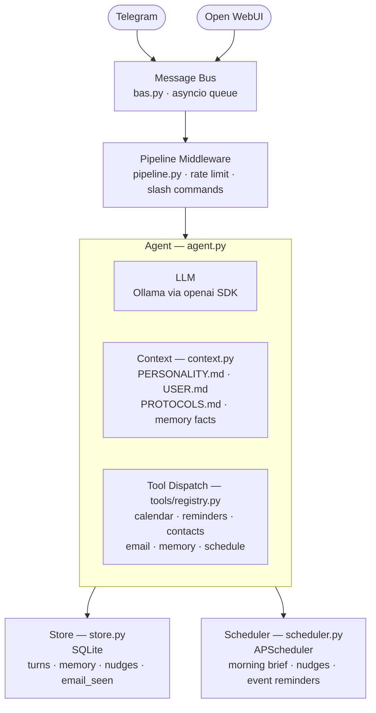

# chives

A local-first ADHD executive assistant agent for macOS. Send it messages via Telegram or Open WebUI; it uses a local Ollama LLM with tool-calling to manage your calendar, reminders, contacts, and email — without any data leaving your machine.

## What it does

- Answers questions and takes actions through natural conversation
- Reads and creates Apple Calendar events and Reminders
- Looks up contacts via AddressBook
- Monitors IMAP email
- Sends proactive nudges and a morning brief on a schedule
- Remembers facts about you across conversations (SQLite-backed memory)
- Runs as a persistent macOS launchd service

## Architecture



`main.py` wires it all together: `Config` → `Store` → `Agent` → `Bus` → connectors + `Scheduler`, running as three concurrent asyncio tasks (bus loop, Telegram polling, FastAPI server for Open WebUI).

## Requirements

- macOS (PyObjC Calendar/Reminders/Contacts integrations are macOS-only)
- [Ollama](https://ollama.com) running locally with a tool-capable model (e.g. `llama3.2`)
- Python 3.11+ via [uv](https://docs.astral.sh/uv/)
- A Telegram bot token (optional — Open WebUI works without it)

## Setup

```bash
# Install dependencies
uv sync

# Configure
cp .env.example .env
# Edit .env with your Ollama URL, Telegram token, IMAP credentials, etc.

# Run in development
uv run python -m chives.main
```

### Configuration

All settings use the `CHIVES_` prefix with `__` for nesting:

```
CHIVES_LLM__BASE_URL=http://localhost:11434/v1
CHIVES_LLM__MODEL=llama3.2
CHIVES_TELEGRAM__BOT_TOKEN=...
CHIVES_TELEGRAM__ALLOWED_CHAT_IDS=[123456789]
CHIVES_IMAP__HOST=imap.example.com
CHIVES_MORNING_BRIEF_TIME=08:00
CHIVES_STATE_PATH=state
CHIVES_PROFILE_PATH=profile
```

### Personalisation

Edit the files in `profile/` to shape the agent's behaviour:

- `PERSONALITY.md` — tone, communication style
- `USER.md` — facts about you: routines, preferences, context
- `PROTOCOLS.md` — standing instructions (how to handle email, what counts as urgent, etc.)

## Running as a service

```bash
# Install as launchd service (starts on login, restarts on crash)
./scripts/install_service.sh

# Uninstall
./scripts/uninstall_service.sh
```

Logs: `logs/chives.log` and `logs/chives.err`.
Service label: `com.chives.agent`.

## Development

```bash
# Run all tests
uv run pytest tests/

# Run a single test file
uv run pytest tests/test_agent.py

# Run a single test
uv run pytest tests/test_agent.py::test_name
```

Tools are registered with `@tool` in `tools/registry.py`, which auto-generates OpenAI JSON schema from the function signature and docstring. Tests must call `clear_registry()` between runs (use the `reset` fixture).
