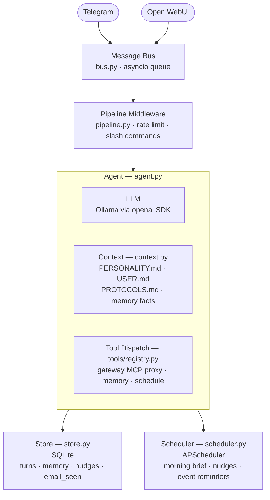

# chives

A local-first executive assistant agent. Uses a local Ollama LLM with tool-calling to manage calendar, reminders, contacts, and email via a gateway MCP server. Runs as a Docker container.

## What it does

- Answers questions and takes actions through natural conversation
- Reads and creates calendar events and reminders
- Looks up contacts
- Monitors IMAP email
- Sends proactive nudges and a morning brief on a schedule
- Remembers facts about you across conversations (SQLite-backed memory)
- Exposes an OpenAI-compatible API so it works as an Open WebUI backend
- Serves a live status page at `GET /`

## Architecture



`main.py` wires it all together: `Config` → `Store` → `Agent` → `Bus` → connectors + `Scheduler`, running as three concurrent asyncio tasks (bus loop, Telegram polling, FastAPI server).

## Running with Docker

The image is published to GitHub Container Registry on every push to `main`:

```bash
docker pull ghcr.io/awfulwoman/chives:latest
```

### Quick start

```bash
# 1. Create your MCP server config
cp mcps.example.yaml mcps.yaml
# Edit mcps.yaml with your gateway URL

# 2. Create your profile
mkdir -p state profile
# Add PERSONALITY.md, USER.md, PROTOCOLS.md to profile/

# 3. Configure and run
cp .env.example .env
# Edit .env with your Ollama URL, Telegram token, IMAP credentials, etc.

docker compose up
```

The status page is available at `http://localhost:8080`.

### MCP servers

Tools are loaded at startup from MCP-over-HTTP servers listed in `mcps.yaml`:

```yaml
mcp_servers:
  - url: http://your-gateway-host/mcp
  - url: http://another-mcp-server/mcp
```

Point `CHIVES_MCP_CONFIG_PATH` at this file. Unreachable servers are skipped with a warning — Chives will still start.

### Configuration

All settings use the `CHIVES_` prefix with `__` for nesting. See `.env.example` for the full list. Key variables:

```
CHIVES_LLM__BASE_URL=http://ollama-host:11434/v1
CHIVES_LLM__MODEL=llama3.2
CHIVES_MCP_CONFIG_PATH=/app/mcps.yaml
CHIVES_TELEGRAM__BOT_TOKEN=...
CHIVES_TELEGRAM__ALLOWED_CHAT_IDS=[123456789]
CHIVES_IMAP__HOST=imap.example.com
CHIVES_MORNING_BRIEF_TIME=08:00
```

### Volumes

| Mount | Purpose |
|---|---|
| `/app/state` | SQLite database (turns, memory, nudges) |
| `/app/profile` | Personality/user/protocol markdown files |
| `/app/mcps.yaml` | MCP server list (read-only) |

### Personalisation

The `profile/` directory controls how the agent thinks and behaves. Mount your own copy at `/app/profile` to override the defaults that ship in the image.

| File | Purpose |
|---|---|
| `PERSONALITY.md` | Tone and communication style — who the agent is |
| `USER.md` | Facts about you: routines, preferences, needs, context |
| `PROTOCOLS.md` | Standing rules — how to handle email, what counts as urgent, when to ask vs. act |
| `CHECKIN.md` | Templates for scheduled check-ins (morning brief, idle nudges) |

All four files are concatenated into the system prompt on every request alongside recent memory facts. You can omit any file you don't need — missing files are silently skipped.

**Minimal example** — create a `profile/` directory alongside your `compose.yml` and add whichever files you want to customise:

```
profile/
  PERSONALITY.md   # "You are Ada, a no-nonsense assistant..."
  USER.md          # "The user is a software engineer who..."
  PROTOCOLS.md     # "Never book meetings before 10am..."
  CHECKIN.md       # "Morning brief should include..."
```

Then mount it in your compose service:

```yaml
volumes:
  - ./profile:/app/profile
```

## Development

```bash
# Install dependencies
uv sync

# Run locally
uv run python -m chives.main

# Run tests
uv run pytest tests/
```

Tools are registered with `@tool` in `tools/registry.py`, which auto-generates OpenAI JSON schema from the function signature and docstring. Tests must call `clear_registry()` between runs (use the `reset` fixture).
